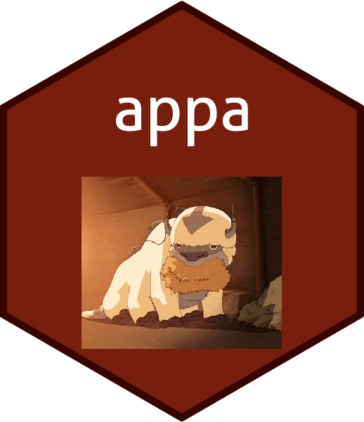

<!-- README.md is generated from README.Rmd. Please edit that file -->

```{r, include = FALSE}
knitr::opts_chunk$set(
  collapse = TRUE,
  comment = "#>",
  fig.path = "man/figures/README-",
  out.width = "100%"
)
```

# appa

The goal of appa is to provide an easy way to share Avatar: The Last Airbender
transcript data.




## Installation

You can install appa from [GitHub](https://github.com/) with:

``` r
# install.packages("devtools")
devtools::install_github("averyrobbins1/appa")
```

## Example

This is a basic example:

```{r, message = FALSE}
library(tidyverse)

dat <- appa::appa

glimpse(dat)

dat %>% 
    ggplot(aes(x = chapter_num, y = imdb_rating)) +
    geom_point() +
    facet_wrap(~ book)
```


