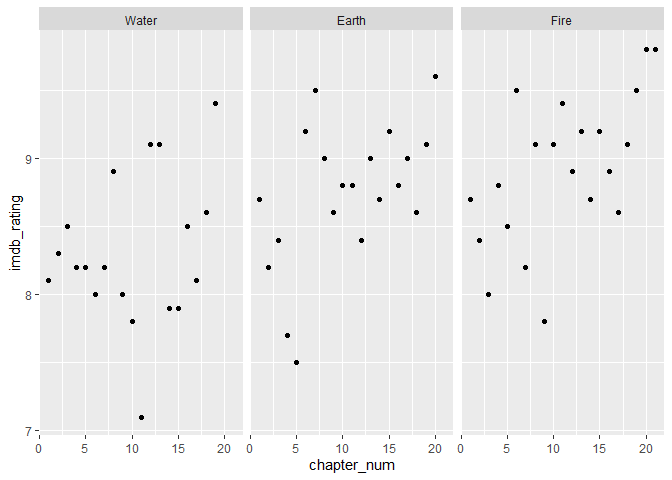

<!-- README.md is generated from README.Rmd. Please edit that file -->

# appa

The goal of appa is to provide an easy way to share Avatar: The Last
Airbender transcript data.


## Installation

You can install appa from [GitHub](https://github.com/) with:

``` r
# install.packages("devtools")
devtools::install_github("averyrobbins1/appa")
```

## Example

This is a basic example:

``` r
library(tidyverse)

dat <- appa::appa

glimpse(dat)
#> Rows: 13,385
#> Columns: 12
#> $ id                <int> 1, 2, 3, 4, 5, 6, 7, 8, 9, 10, 11, 12, 13, 14, 15...
#> $ book              <fct> Water, Water, Water, Water, Water, Water, Water, ...
#> $ book_num          <int> 1, 1, 1, 1, 1, 1, 1, 1, 1, 1, 1, 1, 1, 1, 1, 1, 1...
#> $ chapter           <fct> The Boy in the Iceberg, The Boy in the Iceberg, T...
#> $ chapter_num       <int> 1, 1, 1, 1, 1, 1, 1, 1, 1, 1, 1, 1, 1, 1, 1, 1, 1...
#> $ character         <chr> "Katara", "Scene Description", "Sokka", "Scene De...
#> $ full_text         <chr> "Water. Earth. Fire. Air. My grandmother used to ...
#> $ character_words   <chr> "Water. Earth. Fire. Air. My grandmother used to ...
#> $ scene_description <list> [<>, <>, "[Close-up of the boy as he grins confi...
#> $ writer            <chr> "<U+200E>Michael Dante DiMartino, Bryan Konietzko, Aaron...
#> $ director          <chr> "Dave Filoni", "Dave Filoni", "Dave Filoni", "Dav...
#> $ imdb_rating       <dbl> 8.1, 8.1, 8.1, 8.1, 8.1, 8.1, 8.1, 8.1, 8.1, 8.1,...

dat %>% 
    ggplot(aes(x = chapter_num, y = imdb_rating)) +
    geom_point() +
    facet_wrap(~ book)
#> Warning: Removed 161 rows containing missing values (geom_point).
```


